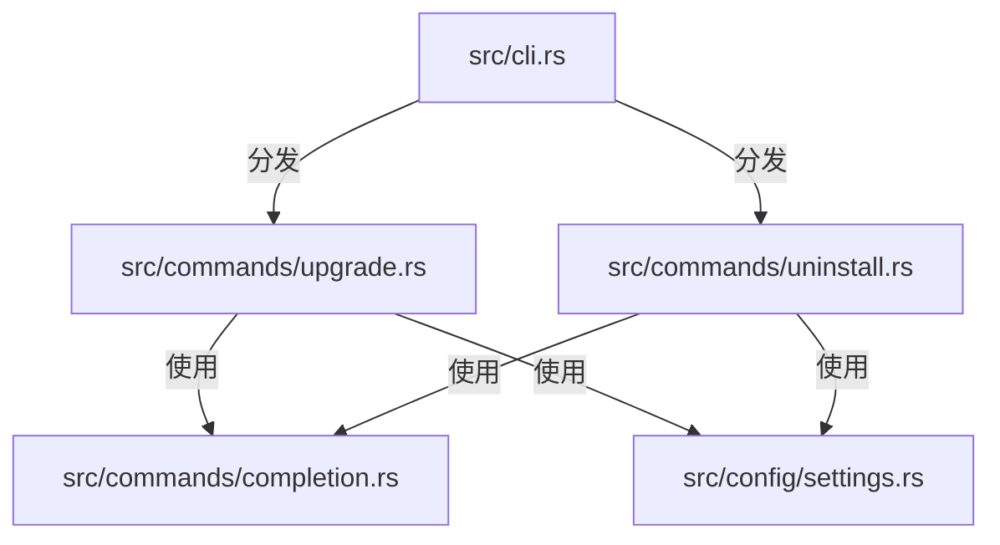
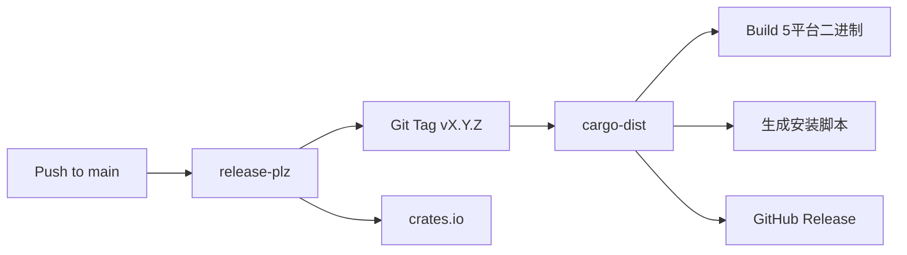
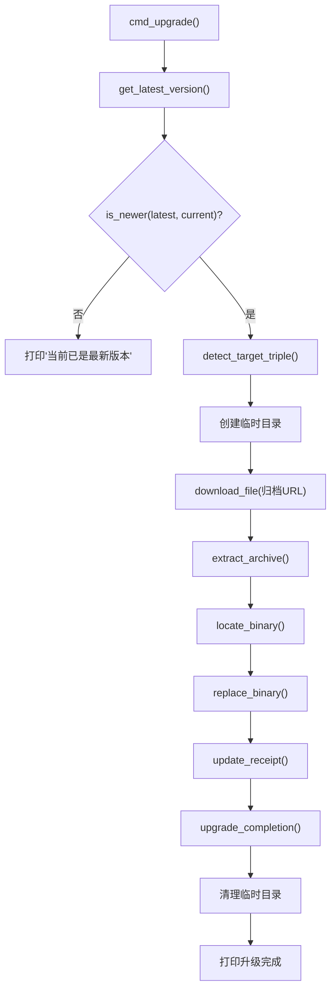
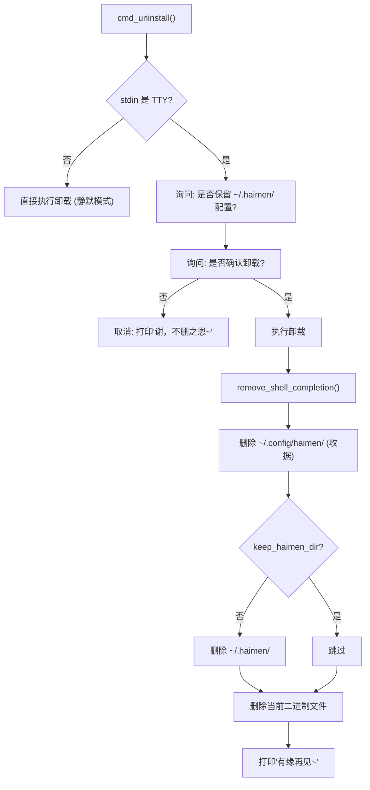

# haimen CLI 安装/升级/卸载功能技术方案

> 基于 `.agents/plans/haimen-cli-enhance/ANALYSIS.md` 分析报告

## 修订历史

| 版本 | 日期 | 修订人 | 说明 |
|------|------|--------|------|
| v1.0 | 2026-06-14 | Claude | 初始版本 |

---

## 1. 概述

### 1.1 目标

为 haimen CLI 工具增加完整的生命周期管理能力：

1. **安装**: 支持 cargo install / 一键脚本 / 手动下载三种安装方式
2. **升级**: `haimen upgrade` — 通过 GitHub Releases 自升级到最新版本
3. **卸载**: `haimen uninstall` — 从系统完整移除自身
4. **文档**: 更新 README.md 反映安装方式和完整 CLI 命令

### 1.2 参考项目

[zapmyco](https://github.com/shenjingnan/zapmyco) 是同一开发者的成熟 Rust CLI 项目，已实现完整的 upgrade/uninstall/completion 功能。本方案严格遵循 zapmyco 的设计模式和代码风格。

---

## 2. 整体架构

### 2.1 目录结构变更

```
src/
├── commands/                    # 新建: 命令实现模块
│   ├── mod.rs                   # 模块声明
│   ├── completion.rs            # Shell 补全安装/移除工具
│   ├── upgrade.rs               # 自升级实现
│   └── uninstall.rs             # 自卸载实现
├── cli.rs                       # 修改: 新增 Upgrade/Uninstall 命令
├── lib.rs                       # 修改: 新增 pub mod commands
...
docs/
└── public/                      # 新建: 安装脚本
    ├── install.sh               # Shell 一键安装脚本
    └── install.ps1              # PowerShell 一键安装脚本
```

### 2.2 模块依赖关系



### 2.3 发布流水线架构



---

## 3. 详细设计

### 3.1 commands/completion.rs

**用途**: 提供 Shell 补全的安装和移除工具函数，供 upgrade 和 uninstall 命令使用。

**公共函数签名**:

```rust
/// 检测当前 shell 类型（从 $SHELL 环境变量）
pub(crate) fn detect_shell() -> Option<&'static str>;

/// 获取 shell 配置文件路径
/// - bash: ~/.bashrc（优先）或 ~/.bash_profile
/// - zsh: ~/.zshrc
/// - fish: ~/.config/fish/config.fish
pub(crate) fn shell_config_path(shell: &str, home: &Path) -> PathBuf;

/// 获取 shell 对应的补全 eval 行
/// - bash: eval "$(haimen completion bash)"
/// - zsh: eval "$(haimen completion zsh)"
/// - fish: haimen completion fish | source
pub(crate) fn completion_line(shell: &str) -> &'static str;

/// 安装 shell 补全（可测试的内部实现，接受参数）
pub(crate) fn setup_shell_completion_inner(
    shell: Option<&str>,
    home: &Path,
) -> Result<String, String>;

/// 安装 shell 补全: 从环境读取 shell/home，调用 setup_shell_completion_inner
pub(crate) fn setup_shell_completion() -> Result<String, String>;

/// 移除所有 shell 配置文件中的补全 eval 行
pub(crate) fn remove_shell_completion(home: &Path);
```

**实现要点**:

1. `setup_shell_completion()` 调用 `detect_shell()` → `shell_config_path()` → 读取文件 → 检查是否已存在 → 不存在则追加
2. `remove_shell_completion()` 遍历 bash/zsh/fish 三种 shell 的配置路径，对每个存在的文件过滤掉补全行
3. 幂等性: 多次安装不会重复添加（检查 `file.contains(line)`），多次移除不会报错

### 3.2 commands/upgrade.rs

**用途**: 实现 `haimen upgrade` 命令，通过 GitHub Releases API 完成自升级。

**公共函数**:

```rust
/// 升级 haimen 到最新版本（main entry point）
pub async fn cmd_upgrade() -> Result<(), String>;
```

**内部函数**:

```rust
/// 从 GitHub Releases API 获取最新版本号
async fn get_latest_version() -> Result<String, String>;

/// 比较两个 semver 版本号
fn compare_versions(a: &str, b: &str) -> Ordering;

/// 检查 latest 是否比 current 更新
fn is_newer(latest: &str, current: &str) -> bool;

/// 检测目标平台 triple
fn detect_target_triple() -> Result<&'static str, String>;

/// 执行的升级步骤（在临时目录中操作）
async fn perform_upgrade(version: &str, triple: &str, tmp_dir: &Path) -> Result<(), String>;

/// 从 URL 下载文件到本地路径（流式写入）
async fn download_file(url: &str, dest: &Path) -> Result<(), String>;

/// 解压归档文件
#[cfg(not(windows))]
fn extract_archive(archive_path: &Path, dest_dir: &Path) -> Result<(), String>;
#[cfg(windows)]
fn extract_archive(archive_path: &Path, dest_dir: &Path) -> Result<(), String>;

/// 在解压目录中定位二进制文件
fn locate_binary(dir: &Path, triple: &str, binary_name: &str) -> Result<PathBuf, String>;

/// 替换当前运行的二进制文件
#[cfg(unix)]
fn replace_binary(new_binary: &Path, current_exe: &Path) -> Result<(), String>;
#[cfg(windows)]
fn replace_binary(new_binary: &Path, current_exe: &Path) -> Result<(), String>;

/// 更新安装收据 ~/.config/haimen/haimen-receipt.json
fn update_receipt(version: &str) -> Result<(), String>;

/// 升级后重新配置 shell 补全
fn upgrade_completion() -> Result<(), String>;
```

**升级流程图**:



**关键实现细节**:

| 步骤 | 实现方式 |
|------|----------|
| 版本检测 | `GET https://api.github.com/repos/shenjingnan/haimen/releases/latest` → 解析 `tag_name`（去 v 前缀） |
| HTTP 客户端 | reqwest 0.12 + `json` feature + `stream` feature, User-Agent: `haimen-upgrade/1.0` |
| 版本比较 | 按 `.` 分割字符串，逐段解析为 u64，不足补 0 |
| 平台检测 | `std::env::consts::ARCH` + `std::env::consts::OS` → 6 种组合 |
| 归档 URL | `https://github.com/shenjingnan/haimen/releases/download/v{version}/haimen-{triple}.tar.xz` (Unix) / `.zip` (Windows) |
| 解压 | Unix: `tar -xJf`, Windows: PowerShell `Expand-Archive` |
| 原子替换 | Unix: copy → rename (同一文件系统保证原子), 0o755 权限; Windows: rename old → copy new |
| 安装收据 | 路径 `~/.config/haimen/haimen-receipt.json`, 格式 `{"version":"X.Y.Z"}` |

**常量定义**:

```rust
const GITHUB_REPO: &str = "shenjingnan/haimen";
const USER_AGENT: &str = "haimen-upgrade/1.0";
```

### 3.3 commands/uninstall.rs

**用途**: 实现 `haimen uninstall` 命令，从系统完整移除自身。

**公共函数**:

```rust
/// 卸载 haimen（交互式 + 清理）
pub fn cmd_uninstall() -> Result<(), String>;

/// 执行卸载清理（不含用户交互，可测试）
pub fn execute_uninstall(
    receipt_dir: &Path,
    haimen_dir: &Path,
    has_receipt: bool,
    keep_haimen_dir: bool,
    exe_path: Option<&Path>,
    home: &Path,
) -> Result<(), String>;
```

**卸载流程图**:



**关键实现细节**:

| 操作 | 实现方式 |
|------|----------|
| 交互 | 使用 `std::io::stdin().is_terminal()` 检测 TTY；使用 `println!` + `std::io::stdin().read_line()` 读取用户输入 |
| 配置保留 | 用户可选择保留 `~/.haimen/`（配置和数据） |
| Shell 补全清理 | `commands::completion::remove_shell_completion()` |
| 收据目录 | 默认 `~/.config/haimen/` |
| 配置目录 | 默认 `~/.haimen/` |
| 二进制删除 | Unix: `std::fs::remove_file()` (运行中文件可删除)；Windows: 提示用户手动删除 |
| 错误处理 | 每个删除步骤独立 try-catch，失败只打印警告不阻断后续流程 |

### 3.4 src/cli.rs 修改

**新增命令枚举**:

```rust
#[derive(Subcommand)]
#[non_exhaustive]
pub enum Commands {
    // ... 现有命令不变 ...
    
    /// 升级 haimen 到最新版本
    Upgrade,
    
    /// 卸载 haimen
    Uninstall,
}
```

**run() 函数新增分发**:

```rust
pub async fn run(cli: Cli) -> Result<(), String> {
    match cli.command {
        // ... 现有分发 ...
        Some(Commands::Upgrade) => commands::upgrade::cmd_upgrade().await,
        Some(Commands::Uninstall) => commands::uninstall::cmd_uninstall(),
        // ...
    }
}
```

### 3.5 依赖变化

```toml
# Cargo.toml
[dependencies]
# 取消注释（原已有被注释行）
reqwest = { version = "0.12", features = ["json", "stream"] }
```

> 注意：流式下载使用已有的 `futures-util` 的 `StreamExt` + reqwest 的 `bytes_stream()`，**无需**额外添加 `tokio-stream` 依赖。

### 3.6 发布流程修复

**release-plz.toml** — 修正包名:

```toml
[[package]]
name = "haimen"            # 原为 "ai-rust-starter"
git_tag_enable = true
git_tag_name = "v{{ version }}"
changelog_update = true
changelog_path = "CHANGELOG.md"
```

**cargo-dist release.yml** — `dist-workspace.toml` 已存在但 `.github/workflows/release.yml` 尚未生成。需手动执行以下命令生成：

```bash
cargo dist init --yes
```

> 该命令由 cargo-dist 0.32.0 提供，会根据 `dist-workspace.toml` 配置自动生成 Release CI 工作流。首次发版前执行一次即可。注意：`dist init` 会读取 `dist-workspace.toml` 中的 targets/installers 等配置。

### 3.7 安装脚本

#### docs/public/install.sh

```bash
#!/bin/sh
# haimen 一键安装脚本（跳转到 cargo-dist 安装器）
set -eu
REPO='shenjingnan/haimen'
INSTALLER_URL="https://github.com/${REPO}/releases/latest/download/haimen-installer.sh"
curl -fsSL "$INSTALLER_URL" | sh
```

#### docs/public/install.ps1

```powershell
# haimen 一键安装脚本（跳转到 cargo-dist 安装器）
$Repo = 'shenjingnan/haimen'
$InstallerUrl = "https://github.com/${Repo}/releases/latest/download/haimen-installer.ps1"
Invoke-WebRequest -Uri $InstallerUrl -OutFile "$env:TEMP\haimen-installer.ps1"
& "$env:TEMP\haimen-installer.ps1"
```

---

## 4. 实施方案

### 4.1 实施步骤

| 步骤 | 操作 | 文件 |
|------|------|------|
| 1 | 修改 Cargo.toml | 取消注释 reqwest（无需 tokio-stream） |
| 2 | 修复 release-plz.toml | 修正包名为 haimen |
| 3 | 新建 src/commands/mod.rs | 模块声明 |
| 4 | 新建 src/commands/completion.rs | Shell 补全工具 |
| 5 | 新建 src/commands/upgrade.rs | 自升级实现 |
| 6 | 新建 src/commands/uninstall.rs | 自卸载实现 |
| 7 | 修改 src/lib.rs | 添加 `pub mod commands` |
| 8 | 修改 src/cli.rs | 添加 Upgrade/Uninstall 命令和分发 |
| 9 | 手动执行 `cargo dist init --yes` | 生成 release.yml（首次发版前执行） |
| 10 | 新建 docs/public/install.sh | 安装脚本 |
| 11 | 新建 docs/public/install.ps1 | PowerShell 安装脚本 |
| 12 | 修改 README.md | 安装说明 + 完整命令文档 |

### 4.2 测试计划

#### completion 模块测试

| 测试用例 | 预期结果 |
|----------|----------|
| `detect_shell()` 从 $SHELL 解析 | bash/zsh/fish 返回 Some，sh/None 返回 None |
| `shell_config_path("bash")` | .bashrc 存在 → .bashrc; 不存在 → .bash_profile |
| `shell_config_path("zsh")` | ~/.zshrc |
| `completion_line("bash")` | `eval "$(haimen completion bash)"` |
| `setup_shell_completion()` 新文件 | 创建文件并写入 eval 行 |
| `setup_shell_completion()` 已有文件 | 追加 eval 行 |
| `setup_shell_completion()` 幂等性 | 第二次调用提示"已配置"而非追加 |
| `remove_shell_completion()` 移除单行 | 补全行被移除，其他内容保留 |
| `remove_shell_completion()` 空文件 | 正常运行不 panic |
| `remove_shell_completion()` 多行匹配 | 所有匹配行都被移除 |

#### upgrade 模块测试

| 测试用例 | 预期结果 |
|----------|----------|
| `compare_versions("1.2.3", "1.2.3")` | Ordering::Equal |
| `compare_versions("1.3.0", "1.2.3")` | Ordering::Greater |
| `compare_versions("1.2.3", "1.3.0")` | Ordering::Less |
| `is_newer("1.3.0", "1.2.0")` | true |
| `is_newer("1.2.0", "1.3.0")` | false |
| `detect_target_triple()` | 返回当前平台的 triple |
| `locate_binary()` 子目录结构 | 找到 `dir/haimen-{triple}/haimen` |
| `locate_binary()` 根目录回退 | 找到 `dir/haimen` |
| `locate_binary()` 找不到 | 返回 Err |
| `update_receipt()` 无收据文件 | 不创建文件 |
| `update_receipt()` 更新 | 覆盖为最新版本号 |
| `replace_binary()` Unix | 文件内容被替换，权限为 0o755，staging 文件被清理 |

#### uninstall 模块测试

| 测试用例 | 预期结果 |
|----------|----------|
| `execute_uninstall()` 空状态 | 正常运行不 panic |
| `execute_uninstall()` 有收据 | 收据目录被删除 |
| `execute_uninstall()` 有配置目录 | 按 keep_haimen_dir 参数删除或保留 |
| `execute_uninstall()` 二进制删除 | Unix 上二进制文件被删除 |
| `execute_uninstall()` 错误处理 | 单个步骤失败不 panic |

#### CLI 集成测试

| 测试用例 | 预期结果 |
|----------|----------|
| `Cli::try_parse_from(["haimen", "upgrade"])` | 解析为 Commands::Upgrade |
| `Cli::try_parse_from(["haimen", "uninstall"])` | 解析为 Commands::Uninstall |
| help 输出包含 upgrade | 帮助信息中包含 upgrade |
| help 输出包含 uninstall | 帮助信息中包含 uninstall |
| completion 包含 upgrade/uninstall | 补全脚本包含新命令 |

---

## 5. 风险与注意事项

| 风险 | 概率 | 影响 | 应对措施 |
|------|------|------|----------|
| reqwest 编译时间增加 | 高 | 低（约+30s） | 首次编译不可避免 |
| GitHub API 限流 | 低 | 中 | 升级检查失败不应阻塞用户，降级提示手动下载 |
| cargo-dist 版本兼容 | 低 | 中 | dist-workspace.toml 中指定精确版本 0.32.0 |
| 原子替换在 Docker 环境 | 低 | 低 | copy + rename 是标准 POSIX 操作 |
| Windows 上二进制自删除 | 中 | 低 | Windows VM 无法删除运行中文件，提示用户手动操作 |

---

## 6. 参考

- [zapmyco upgrade.rs](https://github.com/shenjingnan/zapmyco/blob/main/src/commands/upgrade.rs)
- [zapmyco uninstall.rs](https://github.com/shenjingnan/zapmyco/blob/main/src/commands/uninstall.rs)
- [zapmyco completion.rs](https://github.com/shenjingnan/zapmyco/blob/main/src/commands/completion.rs)
- [cargo-dist Book](https://opensource.axo.dev/cargo-dist/book/)
- [release-plz](https://release-plz.ieni.dev/)
