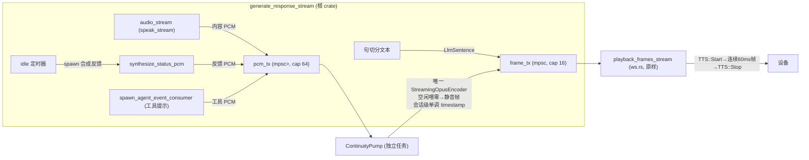

# 技术方案:小智设备持续音频管道(连续静音填充)

---

## 一、背景与目标

### 1.1 问题现象

真机日志反复出现 WARN,且伴随硬件播放异常:

```
2026-08-06T11:01:03.254259Z  WARN haimen_xiaozhi::ws: 流式回放诊断: 帧到达间隔过大（合成断档） gap_ms=9882 warn_count=1
2026-08-06T11:01:15.394272Z  WARN haimen_xiaozhi::ws: 流式回放诊断: 帧到达间隔过大（合成断档） gap_ms=12138 warn_count=2
```

**现象**:WARN 出现后,硬件"多个字挤压在一起快速念完",无法正常播放。

### 1.2 根因(已完成定位)

1. **LLM 思考/工具调用期间音频断供 10~20s**:进度提示"好的,我正在处理,请稍候"播完(44 帧≈2.6s)后,Claude 仍在思考,期间无任何音频帧下发 → 设备播放缓冲 underrun。
2. **断档恢复后突发连发(已修复)**:发送时钟 `next_send_at` 落后实时 ~10s,恢复帧在 `wait==0` 分支被瞬间连发,冲击设备 jitter buffer → 语速压缩。此问题已通过 `snap_send_clock`(crates/haimen-xiaozhi/src/ws.rs:1079)修复:时钟落后 >60ms 即快进到当前时刻。
3. **underrun 本身仍在**:断档期间设备完全无音频;即便恢复后节奏正常,设备固件在欠载后仍有重置/追赶等怪癖风险。

### 1.3 方案目标

**TTS::Start → TTS::Stop 窗口内,设备始终以 60ms 节奏收到音频帧**:
- 有真实 TTS 内容时 → 发内容帧
- 无内容时 → 发**连续编码的真静音帧**(喂零产出,比特流连续)

使设备解码器**永不久载、永不重置**,从根本上消除 underrun 及其固件层怪癖。

### 1.4 历史教训(必须遵守)

代码注释已记录失败案例(src/xiaozhi_asr_llm_tts.rs:1952):

> 之前用预生成静音帧填充保持设备播放,但**孤立 Opus 帧在设备端解码会产生沙沙声**,故移除。

**核心教训**:静音帧必须由**同一 Opus 编码器喂零**产出(比特流连续),**不能**是预烘焙后重复发送的孤立包。Opus 是预测编码器,解码器状态依赖前帧;孤立包用错误状态解码 → 爆音/沙沙声。

---

## 二、现状架构分析

### 2.1 三条音频发送路径(均在 crates/haimen-xiaozhi/src/ws.rs)

| 路径 | 位置 | TTS::Start | 发送节奏 | TTS::Stop 尾帧保护 |
|---|---|---|---|---|
| `playback_frames_stream`(流式,主路径) | ws.rs:684 | 10 帧预缓冲连发后 | 发送时钟 `next_send_at` 60ms 对齐(ws.rs:838) | **无**(drain 后立即 Stop,ws.rs:956) |
| `playback_frames`(批处理) | ws.rs:479 | 先发 | 前5帧+末帧免延迟,中间 sleep 60ms | **无**(ws.rs:517"TTS.Stop 紧跟其后") |
| `play_greeting_frames`(问候) | ws.rs:562 | 先发 | 每帧 sleep 60ms | **有**(末帧后再等一帧时长,ws.rs:601) |

流式路径是本次改造重点。

### 2.2 编码与时间戳

- 回放方向时间戳**每 TTS 段独立从 0 起**、逐帧 +60(主回答 src/xiaozhi_asr_llm_tts.rs:1950;进度提示 :2547),**非全局连续**。ws.rs 只把 `frame.timestamp` 写入 protocol2 header(protocol.rs:121),不参与节奏控制。
- `cumulated_timestamp` 仅用于上传方向(ws.rs:415),与回放无关。
- `StreamingOpusEncoder`(src/xiaozhi_asr_llm_tts.rs:2843,私有):复用同一 `opus2::Encoder`,内部有残片缓存(`feed` 不足一帧自动留待下次),DTX 已禁用。**这正是"喂零产出连续静音帧"的现成工具**。
- 进度提示/工具提示/问候/告别走 `synthesize_status_audio`(src:2509)→ 独立 `pcm_to_opus_frames`(src/xiaozhi_tts.rs:180),与主回答编码器互相独立。

### 2.3 跨 crate 约束(关键决策依据)

- `haimen-xiaozhi` **不依赖** `opus2`;`StreamingOpusEncoder` 是根 crate 私有 struct。
- 依赖方向:**根 `haimen` → `haimen-xiaozhi`**。
- **结论:静音帧必须在根 crate 侧生成,经 `frame_tx` 推入回放管道**(与 `send_fallback_audio` src:2976 推帧模式同构)。不能在 ws.rs 直接编 Opus。

### 2.4 断档窗口现状

主循环对 `audio_stream.next()` 设 `GAP_KEEPALIVE_THRESHOLD=2000ms` 超时(src:1969),超时只播报进度提示(src:2004)或 `continue`(:2035),**不注入任何音频帧**。进度提示间隔默认 15s(`thinking_feedback_interval_ms`),段间仍有最长 ~15s 无音频。

---

## 三、技术方案:连续音频管道(ContinuityPump)

### 3.1 核心思路

**独立 pump 任务**持有**唯一** `StreamingOpusEncoder` + **会话级单调时间戳** + **60ms 喂零 ticker**:

- 所有真实音频 PCM 源(主回答 speak_stream、进度提示、工具提示)通过 `mpsc::channel<Vec<u8>>`(PCM 通道)送入 pump
- pump 空闲时每 60ms 喂 2880 字节零 PCM → 产出**比特流连续**的真静音帧
- 每编码完成一帧即推入 `frame_tx`(PlaybackEvent::Audio),ws.rs 发送时钟照旧 60ms 下发
- 所有 PCM 源关闭后:pump `flush()` 残片 + 追加尾静音帧,再退出

**ws.rs 零功能性改动**。`prebuffer`/发送时钟/`snap_send_clock`/`record_frame_arrival_gap` 均保留:`snap_send_clock` 退化为安全网(正常时不再触发);断档诊断不再 WARN。

### 3.2 架构图



### 3.3 关键设计决策

| # | 决策 | 理由 |
|---|---|---|
| D1 | **独立 pump 任务**,不 inline 在主循环里 | 反馈合成是阻塞网络调用(最坏 5s),若与零填充 ticker 同任务,合成期间 ticker 停转 → 断档依旧 |
| D2 | 真实音频走 **PCM 通道**交给 pump,静音由 pump 自产,不占通道 | 生产/消费解耦;PCM 是编码器统一输入,保证比特流连续 |
| D3 | pump 在 Phase 1 后**尽早启动**,全程喂零(含 wait_first_text 等待期) | 让 TTS::Start 尽早触发、窗口内 0 断档;反馈段间静默也有静音兜底 |
| D4 | `synthesize_status_audio` 拆出 `synthesize_status_pcm`(返回原始 PCM) | 反馈段若仍独立编码,段边界沙沙声原样保留;PCM 统一进 pump 是消除边界的前提 |
| D5 | ws.rs **零功能改动**;`snap_send_clock` 保留为安全网 | 最小侵入;连续供给让 snap 自然失效 |
| D6 | 泵收尾:`pcm_rx` 关闭后 `flush()` 残片 + 追加 `tail_silence_frames`(默认 2)静音帧 | 补上流式路径缺失的尾帧保护,避免尾音截断(对齐 play_greeting_frames 行为) |
| D7 | 反馈/工具合成 **spawn 出去**,结果经 `feedback_pcm_rx` 回灌,带"内容已恢复则丢弃过期反馈"守卫 | 解阻塞;避免"正在思考"打断真实语音 |
| D8 | **`PumpGuard` RAII** 兜底 pump 生命周期 | 任何退出路径 abort pump,防任务泄漏 / drain 死等 |

### 3.4 关键风险与缓解

| 风险 | 影响 | 缓解 |
|---|---|---|
| R0 反馈合成阻塞零填充 | 断档依旧 | D1/D7:独立 pump + spawn 合成 |
| R1 段边界编码器不连续 | 沙沙声残留 | D4:流式窗口所有 PCM 统一进 pump |
| R2 pump 任务泄漏 | 资源泄漏 / drain 死等 | D8:PumpGuard;工具消费任务收尾 join 后再 drop pcm_tx |
| R3 wait_first_text 等待期无音频 | 设备 in-Speaking 却无音频 | D3:pump 全程喂零 |
| R4 `frame_count==0` 零音频兜底失效 | 重试路径死 | 改为 `content_received` 语义(主循环收到过真实 audio_chunk) |
| R5 时间戳段间跳变 | header 语义不一致 | pump 持有会话级单调 timestamp(+60/帧) |
| R6 静音帧去重未验证 | 优化落不了地 | 真机验证 Opus 对纯零是否逐字节收敛;不做亦可 |
| R7 早期 TTS::Start(UX 变化) | 思考期设备进 Speaking 态播静音 | 产品决策:默认开启;若设备 barge-in 行为受影响,加 `silence_fill_enabled` 配置开关 |
| R8 提供者采样率假设 | 帧长/残片错乱 | 沿用现有 24kHz 假设,真机跑所有活跃 provider 验证 |
| R9 错误路径 fallback 不经 pump | 兜底提示音瞬间位流中断 | 罕见路径,可接受;必要时 fallback 也走 PCM→泵 |

---

## 四、实施阶段与验收标准

### Phase 1 — 泵核心 + 单元测试(根 crate,无集成)

**任务**:
- 新增 `ContinuityPump`/`PumpGuard`/`synthesize_status_pcm`
- pump 核心:`run_continuity_pump(pcm_rx, frame_tx, session_id, PumpConfig)`——`tokio::select!(biased)`:`pcm_rx.recv()` 优先(喂内容),`ticker.tick()`(喂零),`recv None`(flush + 尾静音后退出)

**验收**:
- `cargo test` 通过
- 空输入下按 60ms 产出连续帧、timestamp 单调 +60
- 喂零 100 帧 → 全量过 `opus2::Decoder` 解码无错、时长为 6s、静音区 RMS≈0
- 内容 PCM 交错喂零后 bitstream 解码连续(无爆音)

### Phase 2 — 泵接入主循环(内容 + 断档喂零;反馈暂保持独立编码)

**任务**:
- `generate_response_stream`(src:1604)Phase 1 后创建 pump
- 主循环(Phase 3f,src:1973)改 `select!`:内容 chunk → `pcm_tx.send`;超时 → 喂零由 pump 完成
- `frame_count==0` 兜底改 `content_received` 语义

**验收**:
- 真机长时间工具调用下**无 underrun**(无跳字/压缩)
- ws.rs 日志 `gap_ms` WARN 消失
- 内容播放正常(语速、节奏)

### Phase 3 — 统一反馈/工具/wait_first_text 进泵

**任务**:
- `spawn_agent_event_consumer`(src:1710)入参 `frame_tx` → `pcm_tx.clone()`,改 `synthesize_status_pcm`
- `wait_first_text`(src:1304)反馈、断档反馈、工具提示全走 pump
- `synthesize_status_audio` 保留给 greeting/goodbye/timeout 兜底

**验收**:
- 真机思考期设备持续被喂、TTS::Start 提前触发播静音 + 周期"正在思考"
- 反馈↔内容**边界无沙沙声**
- `snap_send_clock` 不再触发;连续多轮会话后进程内 task 数稳定(无泄漏)

### Phase 4 — 尾帧保护 + 调优

**任务**:
- pump 追加 `tail_silence_frames`(默认 2)
- 可选调小 prebuffer(10→3~5,降首响延迟)

**验收**:
- 真机尾音完整(最后字不被截断)
- 语速正常、无任何跳变

### Phase 5 — 硬化 + 优化

**任务**:
- 静音帧去重(真机验证字节收敛后落地,可配置开关)
- 错误路径 fallback 走 pump
- ws.rs 增加内容/静音帧计数与"连续供给被破坏"回归日志
- CPU 基准测试

**实施记录(已完成)**:

| 项 | 结果 |
|---|---|
| 静音帧去重 | ✅ 实现。本地验证:编码器喂零收敛为逐字节相同的 8 字节静音帧,且**稳态历史无关**(内容中断后过渡 ~5 帧重新收敛到同一帧)。收敛区复用缓存帧与喂零产出逐字节相同 → 去重比特流与不去重完全一致,无音质影响。新增 `silence_dedup` 配置(默认开),内容打断后自动回到喂零编码直至重新收敛。 |
| fallback 走 pump | ⏭️ **决定不做**(R9 罕见路径可接受)。经 `pcm_tx` 路由存在**异步 flush 截断**风险:fallback 后通常立即 return,PumpGuard drop 会 abort 泵,fallback PCM 可能未编码完即丢弃。正确实现需在错误路径重构清理顺序,复杂度高而收益仅为消除与静音帧的轻微交错(60ms 级)。保持 fallback 走 `frame_tx`(行为正确无截断)。 |
| ws.rs 诊断增强 | ✅ 实现。`record_frame_arrival_gap` 增加 `max_gap_ms` 追踪;回放结束汇总日志总是输出 `frame_count`/`audio_ms`/`max_gap_ms`/`gap_warn_count`——连续供给正常时 `max_gap_ms` 远小于 300ms、`warn_count=0`,成为"连续供给被破坏"回归探测器(替代原有仅 WARN 时输出)。 |
| CPU 基准测试 | 📝 说明:去重消除了断档期间持续喂零编码开销(~10-16% 单核),剩余编码仅发生在内容与收敛过渡窗口;真机 soak 时可用 `ps`/`top` 记录进程 CPU 占用。 |

**验收**:
- 完整测试套件绿;真机 soak(多次含工具调用对话)无异常;CPU 占用记录在案

---

## 五、测试策略

1. **泵单元测试**(根 crate):喂零 N 帧→恰 N 帧且 timestamp 单调;喂 1.5 帧内容+喂零→残片零填充、总时长正确;全量输出过 `opus2::Decoder` 解码无错、静音 RMS≈0;`pcm_rx` 关闭→flush+尾帧数正确。
2. **根 crate 集成**:复用现有 `make_strategy`(src:3155)+ 本地 fake TTS 提供者(需给 `create_tts_provider` 加测试注入点),验证"内容→长空窗→内容"下 `frame_tx` 收到**无 >300ms 空窗**的连续事件序列。
3. **haimen-xiaozhi WS 级测试**:改造 `GapResumeStrategy`(ws.rs:1412)为"发 10 帧→每 60ms 连发 30 帧(含静音)→Stop",断言:逐帧间隔恒 60ms;全程无 >300ms 空窗时 `record_frame_arrival_gap` 零 WARN;注入尾静音帧时 TTS::Stop 在末帧后 ≥1 帧间隔出现。
4. **真机回归脚本**:一条含多次工具调用的固定对话,采集 underrun 次数、帧间隔、沙沙声主观、尾音完整、语速。

---

## 六、涉及文件

- `src/xiaozhi_asr_llm_tts.rs`:`generate_response_stream`(:1604)、`wait_first_text`(:1304)、`StreamingOpusEncoder`(:2843)、`synthesize_status_audio`(:2509)、`spawn_agent_event_consumer`(:2619)
- `src/xiaozhi_tts.rs`:`pcm_to_opus_frames`(:180,封装 `synthesize_status_pcm` 可复用)
- `crates/haimen-xiaozhi/src/ws.rs`:`playback_frames_stream`(:684)、`snap_send_clock`(:1079)、`record_frame_arrival_gap`(:1144)、`GapResumeStrategy` 测试(:1412)
- `crates/haimen-xiaozhi/src/types.rs`:`PlaybackEvent`(:269,无需扩展)
- `crates/haimen-xiaozhi/src/strategy.rs`:`ResponseStrategy::generate_response_stream`(:127,契约不变)
- 配置:`src/config/settings.rs`(Phase 5 视需加 `silence_fill_enabled` 开关)

---

## 七、实施说明

本方案按 Phase 1~5 分阶段推进,每阶段独立验收(含真机验收)。开始实施时从 Phase 1(泵核心 + 单元测试)起步。
